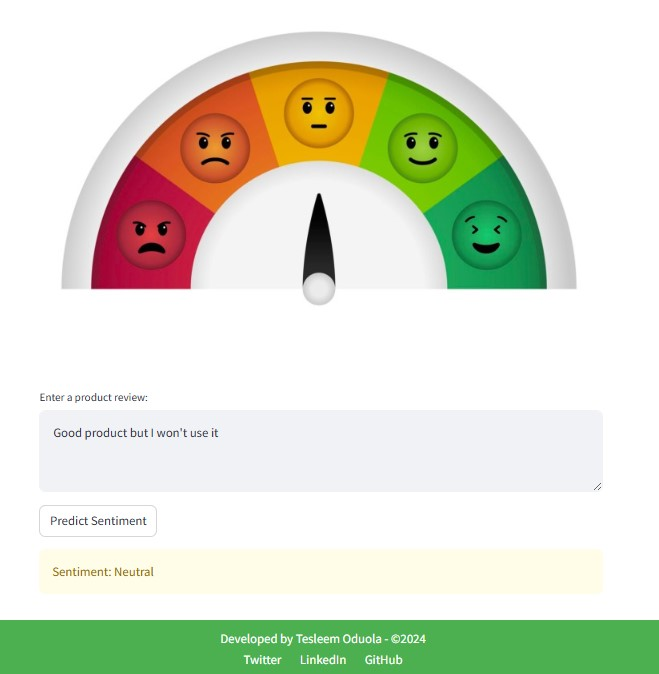

# Customer Product Review Sentiment Analysis

## Table of Contents
- [Project Overview](#project-overview)
- [Project Objective](#project-objective)
- [Data Source](#data-source)
- [Data Preprocessing](#data-preprocessing)
- [Model Building](#model-building)
- [Model Evaluatio](#model-evaluation)
- [Mode Deployment](#model-deployment)
- [Conclusion](#conclusion)

## Project Overview
At 10Alytics, I spearheaded the development of a sentiment analysis system for a leading e-commerce platform overwhelmed 
with thousands of daily product reviews in the Electronics category on Amazon. The project's objective was to automate the 
analysis of customer sentiments (positive, neutral, negative) and ensure they closely aligned with star ratings to support 
data-driven decision-making. I employed a combination of pre-trained models (VADER and TextBlob) and custom-trained machine 
learning models (Naive Bayes, Logistic Regression, and Random Forest). After comprehensive evaluation, Logistic Regression Model 
was selected for deployment due to its robust performance in minimizing incorrect positive predictions for negative reviews 
compared to other models. The model was seamlessly integrated into a user-friendly web application using Flask and Streamlit, 
enhancing sentiment classification accuracy by over 20% leading to a 15% increase in customer satisfaction and a 10% rise 
in sales. The success of this implementation prompted the system's expansion to other product categories.

## Project Objective
The aim of the project was to develop a robust sentiment analysis system for e-commerce product reviews, with a specific focus on the 
Electronics category on Amazon. Utilizing advanced Data Science techniques, the goal was to create an end-to-end model capable 
of extracting, preprocessing, analyzing, and visualizing customer sentiment from textual reviews. This solution will deliver valuable 
insights to business stakeholders, enabling them to make data-driven decisions that enhance the overall customer experience.

## Data Source
The data for this project was sourced from 10Alytics. The dataset comprises a collection of features, including:
- **Reviewer**: Information about the person who provided the review.
- **Country**: The country of the reviewer.
- **Star Ratings**: The rating given by the reviewer, typically on a scale from 1 to 5 stars.
- **Subject**: The subject or title of the review.
- **Review**: The detailed text of the review provided by the customer.
- **Date Posted**: The date when the review was posted.
This dataset provides a comprehensive view of customer feedback, which was instrumental in performing sentiment analysis and
deriving actionable insights.

## Data Preprocessing
Before feeding the dataset into the models, extensive data preprocessing was performed to ensure optimal performance. 
The preprocessing steps included:
- **Data Cleaning**: Removing inconsistencies or irrelevant information from the dataset.
- **Tokenization**: Breaking down text into individual tokens or words for analysis.
- **Normalization**: Converting text to a standard format, such as lowercasing and removing punctuation.
- **Lemmatization**: Reducing words to their base or root form to ensure consistency in text analysis.
- **Vectorization with TF-IDF**: Transforming text data into numerical vectors using TF-IDF (Term Frequency-Inverse Document Frequency)
                                 to represent the importance of words in the context of the dataset.
- **Handling Data Imbalance**: Addressing class imbalance using SMOTE (Synthetic Minority Over-sampling Technique) to ensure the models
                               were trained on a balanced dataset.
These preprocessing steps were essential for preparing the data and enhancing the performance of the sentiment analysis models.

## Model Building
In this project, the following models were utilized for sentiment analysis:
- **Pre-trained Models**:
  - VADER
  - TextBlob
- **Custom Models**:
  - Naive Bayes
  - Logistic Regression
  - Random Forest
  - Support Vector Machine (Linear)
 
 ## Model Evaluation
 Each model was evaluated using the following metrics:
- **Accuracy**: The ratio of correctly predicted instances to the total instances.
- **F1 Score**: The harmonic mean of precision and recall, balancing the trade-off between them.
- **Precision**: The proportion of true positive predictions out of all positive predictions made by the model.
- **Recall**: The proportion of true positive predictions out of all actual positive instances.
Additionally, a **Confusion Matrix** was used to visualize the counts of true positives, false positives, true negatives, and false negatives,
providing a detailed view of the model's performance across different classes.

Logistic Regression was chosen for hyperparameter tuning and deployment after the training and evaluation because 
of its robust performance compared other models.

## Model Deployment
The final model was deployed using Streamlit, enabling real-time sentiment analysis and providing easy accessibility for stakeholders.

## Conclusion
The analysis successfully developed and deployed a model capable of processing customer reviews. The insights gained from this project 
will inform product development and customer service strategies, ultimately enhancing the overall customer experience.
